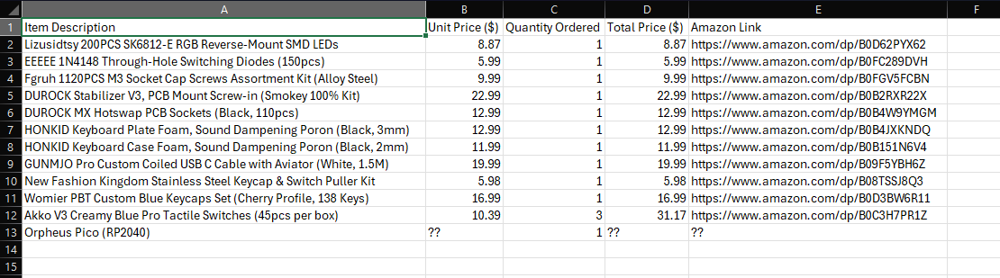
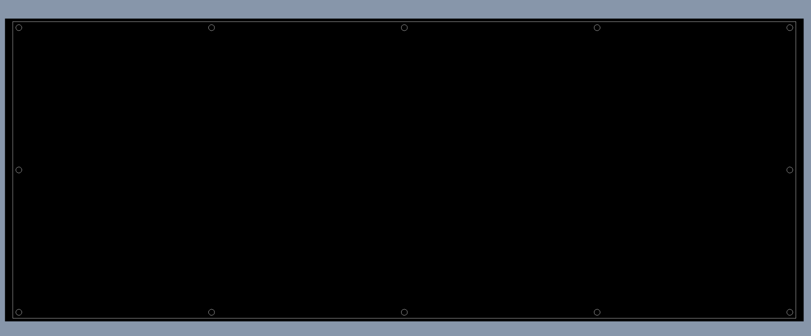
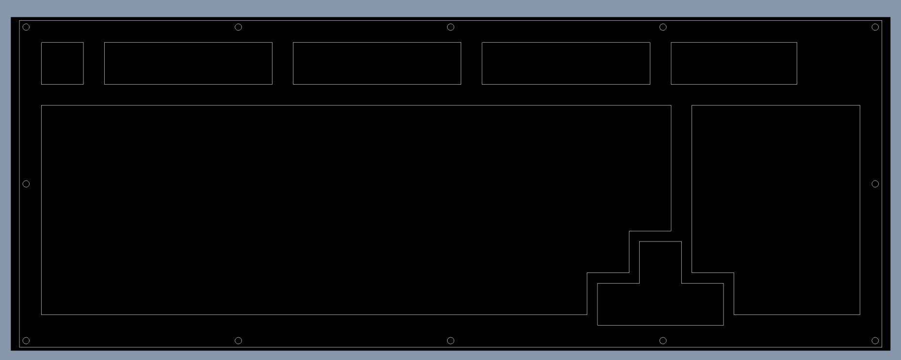
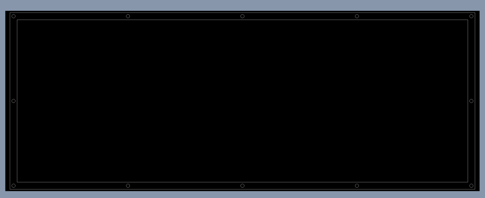
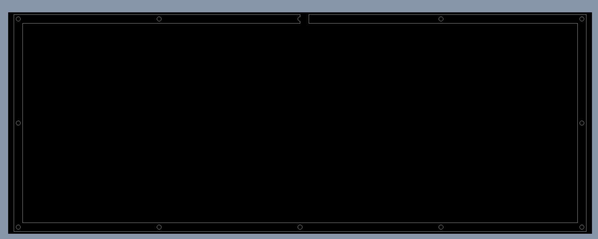
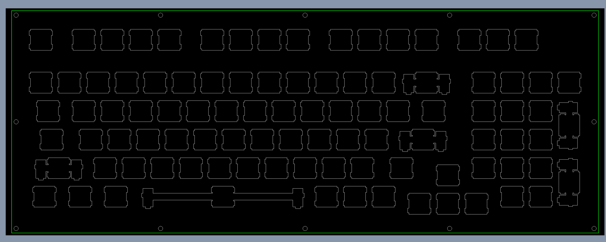
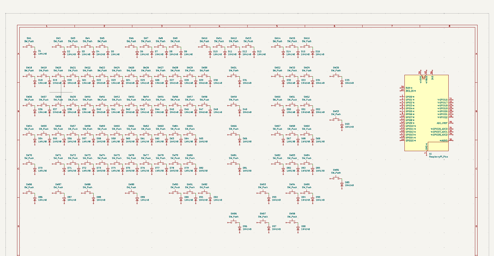

# vBoard - Build Journal

A running log of me building vBoard, a 96% / 1800-compact mechanical keyboard for my English teacher. Running an Orpheus Pico (RP2040) and RMK for firmware.

Times are rough, i just eyeball it and round to the nearest half hour.

---

## Sept 1 - Getting the idea down / research

Spent the first bit just figuring out what i actually want to build. My english teacher's office keyboard is basically falling apart and he's always complaining his hands hurt after grading, so i figured a custom mech board would be a cool thing to make for him. Watched a bunch of youtube build vids and read some geekhack + keebtalk threads to get a feel for what im getting into.

Also looked into layouts. I want something that keeps the numpad since he's entering grades all day, but i dont want a full fat fullsize. Landed on a 96% / 1800-compact. You get the numpad and arrows but everything is smushed together so it takes way less desk space. Seems perfect for his cramped desk.

~1 hr

---

## Sept 2 - Layout decisions + controller pick

Kept going on the 96% thing. Made a rough list in my notes of everything i think i'll need - pcb, plate, case, switches, stabs, keycaps, diodes, sockets, controller. Realized theres a LOT of little parts i wasnt thinking about (screws, foam, etc).

Big decision today was the controller. Instead of designing around a raw rp2040 chip and dealing with the usb + crystal + power stuff myself, im gonna use an Orpheus Pico. Its basically a rpi pico footprint running the RP2040 so i can socket it and not have to reflow a tiny qfn chip on my first ever pcb. Way less scary. Definately going with RMK for the firmware too since its rust based and i want to learn rust anyway, and it supports the rp2040 fine.

~0.5 hr

---

## Sept 3 - KiCad install + libraries (setup)

Downloaded and installed KiCad. Took a little while cuz the installer is chonky. Then spent most of the time getting libraries set up - grabbed the keyswitch kicad library and the kbd footprint libs so i have MX hotswap footprints and stab cutouts ready to go. Also pulled in a diode footprint set.

Had a dumb issue where kicad couldnt find the footprint tables, had to go into preferences and manually point it at the library paths. Fixed eventually. Made a github repo for the project too so everything is backed up.

~1 hr (setup)

---

## Sept 4 - Figuring out the CAD side (setup)

The case is gonna be a stacked/sandwich design - a bunch of flat layers screwed together with M3 screws. For now im not doing any 3d modeling, just 2d drawings of each layer that i can send off to get laser cut. So this session was me figuring out my drawing workflow and how to get clean DXF profiles out.

Im a software person, not a mechanical one, so honestly all of this cad stuff is new to me. Did a couple beginner 2d sketching tutorials so my outlines come out as proper closed loops. No real drawing yet, just getting my head around it.

~1 hr (setup)

---

## Sept 5 - BOM (setup)

Sat down and actually built out my bill of materials. Went thru amazon and picked out everything, put it in a bom.csv so i can track prices. Heres the gist:

- SK6812-E reverse mount rgb leds (for per key rgb, the reverse mount ones shine thru the switch)
- 1N4148 diodes for the matrix
- M3 socket cap screw kit for holding the case layers together
- Durock V3 screw in stabilizers (smokey)
- Durock MX hotswap sockets so i dont have to solder every switch
- plate foam (3mm poron) + case foam (2mm poron) for sound
- coiled usb c cable cuz it looks cool
- switch + keycap puller kit
- Womier PBT keycaps, cherry profile, blue
- Akko V3 Creamy Blue Pro tactile switches (got 3 boxes, 45 each = 135, enough for a 96% with spares)

Total came out to around $160ish which isnt bad. Double checked the switch count against how many keys a 1800 layout has, should be fine with a few extra.

~1 hr (setup)

---

## Sept 6 - Planning the layout in KLE + CAD drawings start

Built the exact 96% layout in keyboard layout editor (KLE) first so i know where every key sits and what size it is. Getting the 1800 arrangement right is fiddly - the arrow keys and nav cluster get tucked in tight and the numpad has to line up on the right. Once it looked right i used it as my reference for drawing.

Then started the actual case layer drawings. These are just 2d drawings for now, one profile per layer, that ill get laser cut. Got the outer profile done first so i can reuse it across every layer. This is my first time really doing cad so its slow going, lots of undo.

~2 hr

---

## Sept 8 - More layer drawings

Kept going on the layers. Reused the outer profile across the stack:
- top layer (bezel that frames the keycaps)
- switch layer / plate (all the switch cutouts)
- open + closer layers (spacers for depth / to hide the pcb edge)
- bottom plate (the base)

Being a swe and not a mech engineer, laying out precise dimensioned cutouts is a whole different brain than writing code. Took me a while to get comfy with constraints and getting things to actually snap where i want. Got the easy layers (top, bottom, spacers) mostly done.

~2 hr

---

## Sept 9 - Switch cutout grind

The switch plate is the painful one - gotta cut a 14x14mm hole for every single switch, ~100 of them, all positioned off my KLE layout. Spent basically the whole session just placing and lining up switch cutouts. Very tedious and i kept second guessing my spacing (19.05mm grid) so i measured a bunch of times.

Got most of the switch cutouts placed. My eyes hurt lol.

~1.5 hr

---

## Sept 11 - Stabilizer cutouts

Did the stabilizer cutouts for the bigger keys (spacebar, both shifts, enter, backspace, numpad plus/enter). Looked up the official durock v3 stab cutout dimensions cuz my first attempt was just plain rectangles that were the wrong shape. Redid them properly.

Learning as i go how much little details matter in mechanical stuff - a cutout being half a mm off actually matters here, which is not something i deal with in software. Slow but getting there.

~1.5 hr

---

## Sept 13 - v2 switch layer + screw holes

Realized my switch cutouts were a hair too tight for the switch clips to actually seat, so i did a v2 of the switch layer with slightly cleaner cutouts. Then added all the M3 screw holes across the layers - corners plus a few in the middle so the plate doesnt bow.

The important part was making the screw holes line up across every single layer so one screw can pass straight thru the whole stack. Went hole by hole checking alignment. Found a couple that were off and fixed them.

~1.5 hr

---

## Sept 15 - Fitment check + DXF cleanup

Went over all the layer drawings and imagined the whole stack together - screw holes have to pass thru clean, plate cutouts have to sit over where the switches go. Fixed one hole that was off by about a mm so a screw wouldnt go straight.

Then cleaned up the DXFs for export. When you export you sometimes get little duplicate lines or tiny gaps that mess up a laser cutter, so i went thru each layer (toplayer, switchlayer + v2, openlayer, closerlayer, botplate) and made sure every profile is one closed loop with no doubles. Pushed everything to github too.

~2 hr

---

## Sept 16 - Trying to learn KiCad (its hard)

Ok so now i need to actually design the pcb and this is where im struggling. KiCad is a LOT. Spent this whole session just going thru tutorials - schematic editor, symbols, footprints, how the netlist flows into the pcb editor. Coming from software none of this workflow is intuitive to me yet.

Didnt produce anything real, just poking around and following along with a beginner keyboard pcb tutorial to try to understand the process. Definately gonna take me a few sessions before im making my own schematic.

~2 hr

---

## Sept 18 - Exported the case drawings

Exported all the layer DXFs proper and gave them one more look to sanity check the switch cutouts are all there and the right size. These are done and ready to send to a laser cutting service whenever. Feels good to have at least the whole case side basically finished even if it took forever.

~1 hr

---

## Sept 19 - More KiCad learning + ordered parts

Went back to KiCad and kept learning. Started by figuring out how to the Orpheus Pico into my schems. Imported a normal RP2040 instead. Got partway thru placing the pins off the pinout but its still rough, more of a learning exercise than a finished part. Still finding the whole thing pretty hard.

Also placed my amazon orders off the bom now that the case design is locked - confirmed 135 switches covers the layout with spares, 138 keycaps covers it, and enough hotswap sockets (110) and diodes. Now i wait for parts once i get the grant thru.

~1.5 hr

---

## Next up

Where im at: BOM is done and parts are ordered, the 2d case layer drawings are done + exported. The pcb is the big remaining thing - im still learning KiCad and haven't made the real schematic yet. Still to do:

- keep learning KiCad, finish the Orpheus Pico symbol/footprint
- draw the schematic (switch matrix + diodes, sk6812 rgb chain, wire it to the pico)
- assign footprints, place switches in the 1800 layout, route the board, run DRC
- export gerbers to get the pcb made + get the case layers laser cut
- set up the RMK firmware project (rust toolchain for rp2040) and write the keymap
- solder diodes + sockets + leds, flash the pico, test the matrix
- assemble case + foam + stabs + switches + keycaps, final testing + rgb tuning

---

### Time so far

Rough running total, not exact:

- Setup (research, KiCad install, CAD workflow, BOM): ~4.5 hrs
- CAD case layer drawings (KLE, cutouts, stabs, fitment, DXF export): ~11.5 hrs
- Learning KiCad: ~3.5 hrs
- Ordering parts: ~1.5 hrs

Around 21 hrs in as of today the 20th. Most of it went into the cad since im a swe and the mechanical/drawing side is all new to me. KiCad is the wall im hitting now. Goal is 30 by the end of the month, so ~9 more hrs to go once i actually get the pcb and firmware going.

## Additional Work done on the 20th:
Oh my gosh kicad is hard.

~1.5 hr